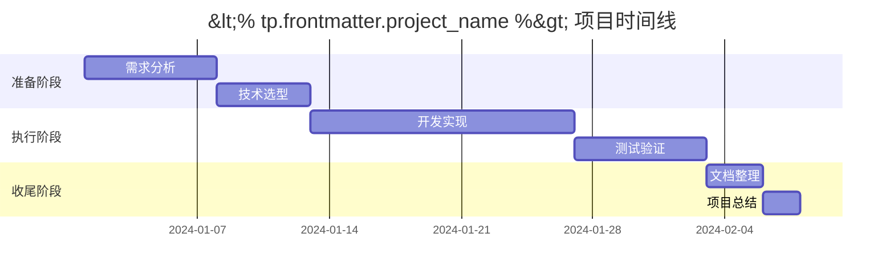

# <% tp.file.title %>

## 📋 项目概览
- **项目名称**：<% tp.frontmatter.project_name %>
- **状态**：<% tp.frontmatter.status %>
- **优先级**：<% tp.frontmatter.priority %>
- **截止日期**：<% tp.frontmatter.deadline %>
- **负责人**：
- **参与人员**：

## 🎯 项目目标
### 主要目标
1. 
2. 
3. 

### 成功标准
- 
- 
- 

## 📝 项目计划

### 阶段划分
#### 第一阶段：准备阶段
- [ ] 
- [ ] 
- [ ] 

#### 第二阶段：执行阶段
- [ ] 
- [ ] 
- [ ] 

#### 第三阶段：收尾阶段
- [ ] 
- [ ] 
- [ ] 

### 时间线


## 📁 项目资源

### 文档链接
- [需求文档]()
- [设计文档]()
- [API文档]()

### 相关文件
- 
- 
- 

## 💬 会议记录
```dataview
TABLE file.ctime as "时间"
FROM "会议记录"
WHERE contains(file.name, "<% tp.frontmatter.project_name %>")
SORT file.ctime DESC
```

## 📊 进度跟踪
```dataview
TASK
FROM #project/<% tp.frontmatter.project_name %>
WHERE !completed
SORT priority DESC, created ASC
```

## 🔗 相关项目
- [[相关项目1]]
- [[相关项目2]]

## 🏷️ 项目标签
#project #project/<% tp.frontmatter.project_name %>